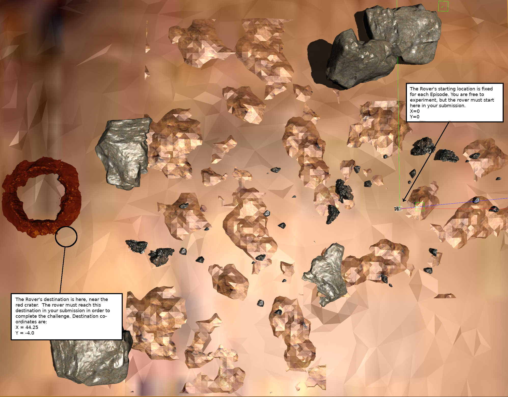

# What are the rules?

Simply put - you must train an RL agent to successfully navigate the Rover to a predetermined checkpoint on Mars.

The below images show the NASA-JPL Open Source Rover (on the left) and your digital version of the Rover on the right

We have simplified the action space to three discrete options:
1. Turn left
2. Turn right
3. Stay Straight

We have set the Rover to use a constant, even linear acceleration, in other words, you cannot make the Rover go faster or slower at this time. Wall Time is not a factor in the scoring mechanism.

The RL-agent leverages rl_coach to manage the training process. In this workshop, we will use a clipped PPO algorithm but you are free to use a different algorithm

Your RL-agent must navigate the Rover to a checkpoint (see image below):

# Scoring Algorithm

The scoring algorithm calculates a score when the Rover reaches the destination point, without collisions, in single episode
> Begin with 10,000 basis points
> Subtract the number of (time) steps required to reach the checkpoint
> Subtract the distance travelled to reach the checkpoint (in meters)
> Subtract the Rover's average linear acceleration (measured in m/s^2)

The scoring mechanism is designed to reflect the highest score for the Rover that:
> Reaches the destination by means of the most optimized path (measured in time steps)
> Reaches the destination by means of the most optimized, shortest path (measured in distance traveled)
> Reaches the destination without experiencing unnecessary acceleration that could represent wheel hop or drops
        
        
While familiarity with RoS and Gazebo are not required for this challenge, they can be useful to understand how your RL-agent is controlling the Rover. You will be required to submit your entry in the form of an AWS Robomaker simulation job. This repo can be cloned directly into a (Cloud9) Robomaker development environment. It will not do a very good job training, however as the reward_function (more on that below) is empty.

All of the Martian world environment variables and Rover sensor data are captured for you and are then made available via global python variables. You must populate the method known as the "reward_function()". The challenge ships with examples of how to populate the reward function (found in the Training Grounds Gym environment). However, no level of accuracy or performance is guaranteed as the code is meant to give you a learning aid, not the solution.

If you wish to learn more about how the Rover interacts with it's environment, you can look at the "Training Grounds" world that also ships with this repo. It is a very basic world with monolith type structures that the Rover must learn to navigate around. You are free to edit this world as you wish to learn more about how the Rover manuevers.

**DO NOT EDIT THE ROVER DESCRIPTION (src/rover)** The Rover description that ships with this repo is the "gold standard" description and it will be the Rover used to score your entries to the competition.

**DO NOT EDIT THE MARTIAN WORLD (src/mars)** The Martian world that ships with this repo is the "gold standard" and it is the same one that will be used to score your entry

### Clean-up

In this activity, you created a Development environment, CloudWatch logs, and S3 objects that incure cost. Please follow the clean-up steps in the main. README document on how to remove these and stop any potential costs for occurring.
